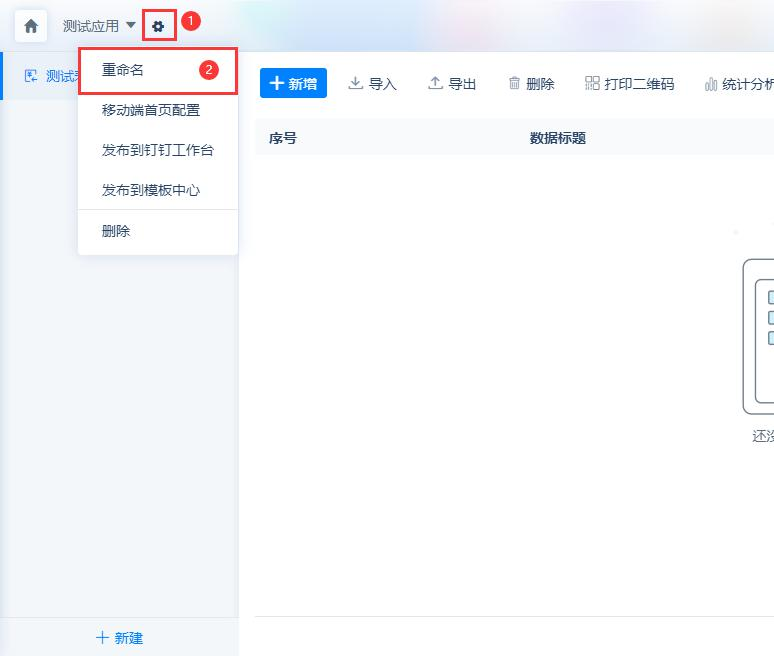
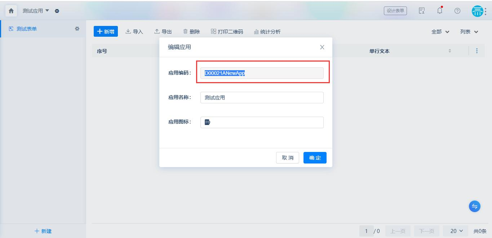
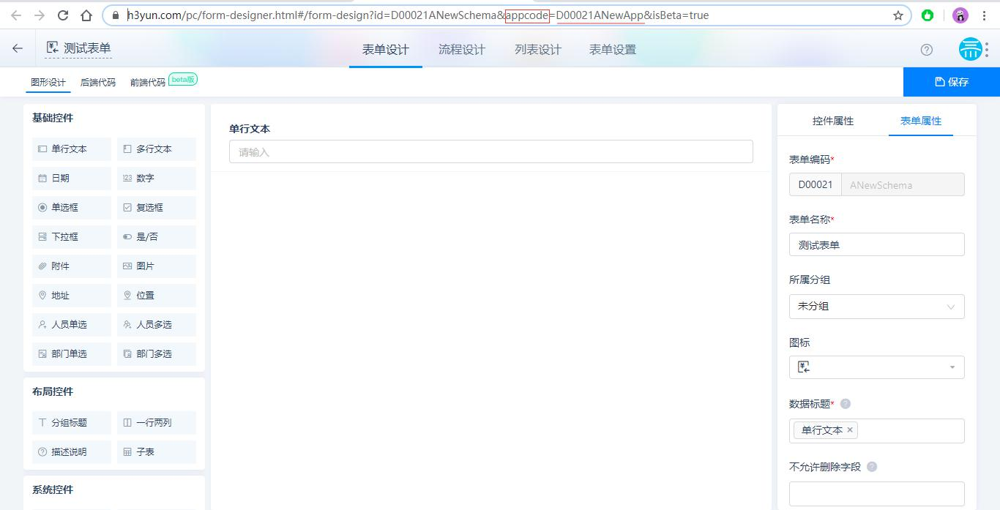
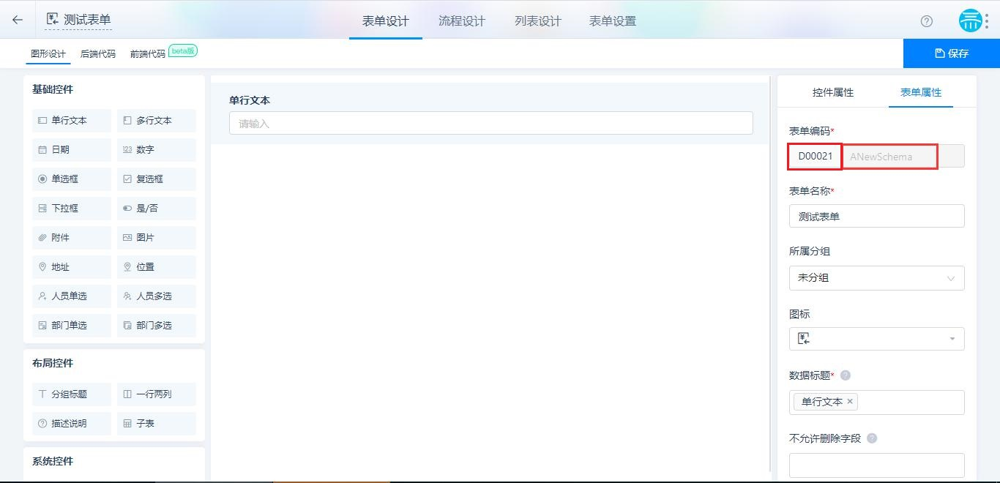

## 应用/表单编码查看

### 应用编码查看

1. 方式一

点击应用重命名 --> 弹出应用信息框 --> 双击选择应用编码复制即可




2. 方式二

在浏览器里打开氚云 --> 打开应用内任意一个表单 --> 点击【设计表单】按钮 --> 查看当前网页URL中的appcode参数值（appcode参数值即应用编码）




### 表单编码查看

1. 方式一

点击 **设计表单** 按钮 --> 点击表单属性 --> 找到表单编码 --> 双击选择表单编码复制即可 *此处要注意，若该表单是在专业版下创建的，灰色框前的D00021也属于表单编码的一部分*



2. 方式二

点击 **设计表单** 按钮 --> 查看当前网页URL中的id参数值 *id参数值即表单的完整编码，无需判断是否专业版下创建*


### 子表编码查看

点击 **设计表单** 按钮 --> 在设计页面点击子表控件 --> 右边控件属性中的控件编码即子表编码 *编码很长，注意复制完整*


### 控件编码查看

#### 主表控件编码查看

点击 **设计表单** 按钮 --> 点击要查看的控件 --> 右边 **控件属性栏** 栏内，控件编码框内即为控件编码

#### 子表里的控件 控件编码查看

点击 **设计表单** 按钮 --> 子表里的控件 --> 右边 **控件属性** 栏内，控件编码框内即为控件编码

> 注意：子表内的控件编码格式是 **子表控件编码**.**控件编码** 组成，
>
> 只需要取用后半部分，例：完整编码是 ```D154601FChildTable.F0000001``` ，只取用 ```F0000001``` 即可。


