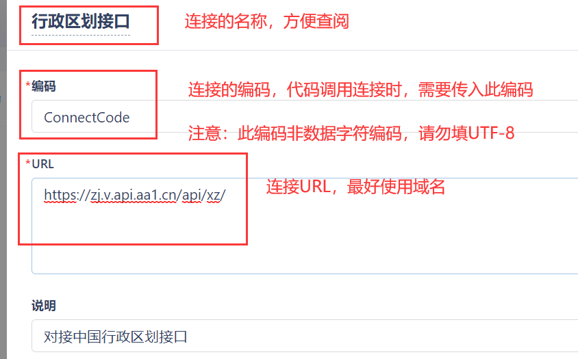

# 氚云调用WebAPI

第三方Api要求：Http/Https协议，请求参数和响应数据不支持文件类型，且响应数据必须是JSON格式

步骤：

1. 在 **插件中心** 新建连接（注意：编码框内填该连接的Code，不是填UTF-8、ASCII等数据编码）




2. 书写代码，代码中有一个传入参数即连接编码，用来指定使用哪个连接

以下是一个请求示例：

``` cs
/*
    第一步：
    定义响应数据结构体，如响应JSON为：

    {"code":200,"ID":"654028207203","msg":"查询成功，查询花费0.0002秒","data":{"Name":"阔克托干村","Province":"新疆维吾尔自治区","City":"伊犁哈萨克自治州","District":"尼勒克县","Tow":"喀拉托别乡","Villag":"阔克托干村","LevelType":"5"}}

    则按以下代码进行定义
*/

//定义响应数据整体结构体
H3.BizBus.BizStructureSchema structureSchema = new H3.BizBus.BizStructureSchema();
structureSchema.Add(new H3.BizBus.ItemSchema("code", "返回码", H3.Data.BizDataType.Int, null));
structureSchema.Add(new H3.BizBus.ItemSchema("ID", "返回内容", H3.Data.BizDataType.String, null));
structureSchema.Add(new H3.BizBus.ItemSchema("msg", "返回内容", H3.Data.BizDataType.String, null));

//定义响应数据的 data 属性 的结构体
H3.BizBus.BizStructureSchema dataSchema = new H3.BizBus.BizStructureSchema();
dataSchema.Add(new H3.BizBus.ItemSchema("Name", "返回内容", H3.Data.BizDataType.String, null));
dataSchema.Add(new H3.BizBus.ItemSchema("Province", "返回内容", H3.Data.BizDataType.String, null));
dataSchema.Add(new H3.BizBus.ItemSchema("City", "返回内容", H3.Data.BizDataType.String, null));
dataSchema.Add(new H3.BizBus.ItemSchema("District", "返回内容", H3.Data.BizDataType.String, null));
dataSchema.Add(new H3.BizBus.ItemSchema("Tow", "返回内容", H3.Data.BizDataType.String, null));
dataSchema.Add(new H3.BizBus.ItemSchema("Villag", "返回内容", H3.Data.BizDataType.String, null));
dataSchema.Add(new H3.BizBus.ItemSchema("LevelType", "返回内容", H3.Data.BizDataType.String, null));
//将 data 属性的结构体添加进整体的响应数据结构体
structureSchema.Add(new H3.BizBus.ItemSchema("data", "返回内容", H3.Data.BizDataType.BizStructure, dataSchema));


//header 请求参数初始化，此实例会添加到请求的 Headers 中
Dictionary < string, string > headers = new Dictionary<string, string>();

//query 请求参数初始化，此处添加的参数会附加在请求Url后（例：?code=654028207203）
Dictionary < string, string > querys = new Dictionary<string, string>();
querys.Add("code", "654028207203");

//body 请求数据初始化，此实例会转换为JSON格式发送给接口
Dictionary < string, object > bodys = new Dictionary<string, object>();

//本示例是在表单后端事件中调用，所以H3.IEngine实例可以用this.Engine获取
H3.IEngine engine = this.Engine;

//调用Invoke接口，系统底层访问第三方接口的Invoke方法
H3.BizBus.InvokeResult res = engine.BizBus.InvokeApi(
    H3.Organization.User.SystemUserId, //固定值，无需改变
    H3.BizBus.AccessPointType.ThirdConnection, //固定值，无需改变
    "ConnectCode", //连接编码，对应 插件中心 中配置的连接的编码
    "GET", //请求方式，取值：GET / POST
    "text/html;charset=utf-8", //请求数据类型
    headers, querys, bodys, structureSchema);
if(res != null)
{
    int resCode = res.Code; //调用是否成功
    if(resCode == 0)
    {
        //获取返回数据，此实例对应完整的响应JSON
        H3.BizBus.BizStructure resData = res.Data;

        //获取响应数据中的 ID 属性值
        string ID = resData["ID"] + string.Empty;

        //获取响应数据中的 data.Name 属性值
        H3.BizBus.BizStructure d = (H3.BizBus.BizStructure) resData["data"];
        string n = d["Name"] + string.Empty;
    }
    else
    {
        //获取错误信息
        string resMessage = res.Message;
        throw new Exception("接口调用失败：" + resMessage);
    }
} else
{
    throw new Exception("接口响应数据为空！");
}
```

!> 注意：连接URL最好使用域名方式，如果使用 IP:Port 方式，端口号可能处于氚云防火墙黑名单中。
如条件受限，只能使用 IP:Port 方式，配置上后，连接请求一直卡死无响应，可以切换到 200-300 范围内的端口试试。